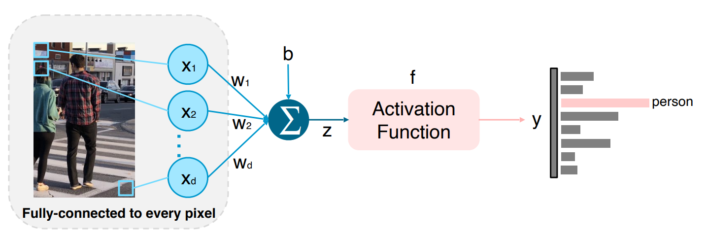

# Image Classification?

- 이미지를 입력으로 받아 이를 분류하는 작업

이미지 분류는 기본적으로 이미지가 입력으로 들어오면 Classifier를 통해 Class를 알려주는 형태의 Task

Example) Very Simple FCN Structure

모든 Pixel을 서로 다른 가중치로 Weighted sum 해주는 방식

- Viewpoint variation (관점변화). 객체의 단일 인스턴스는 카메라와 관련하여 다양한 방식으로 방향을 지정할 수 있음
- Scale variation (스케일 변형). 시각적 클래스는 종종 크기가 다양함(이미지에서의 크기 뿐만 아니라 실제 세계의 크기)
- Deformation (변형). 많은 객체들은 고정된 형태가 없고, 극단적인 형태로 변형될 수 있음
- Occlusion (가림). 객체들은 전체가 보이지 않을 수 있음, 때로는 물체의 매우 적은 부분(매우 적은 픽셀)만이 보임
- Illumination conditions (조명 조건). 조명의 영향으로 픽셀 값이 변형됨
- Background clutter (배경이 복잡). 객체가 주변 환경에 섞여(blend) 알아보기 힘들게 됨
- Intra-class variation (클래스 내 변형). 분류해야할 클래스는 범위가 큰 것들이 많음. 예를 들어 의자의 경우, 매우 다양한 형태의 의자 객체가 있으며, 각각 고유한 모양들이 
